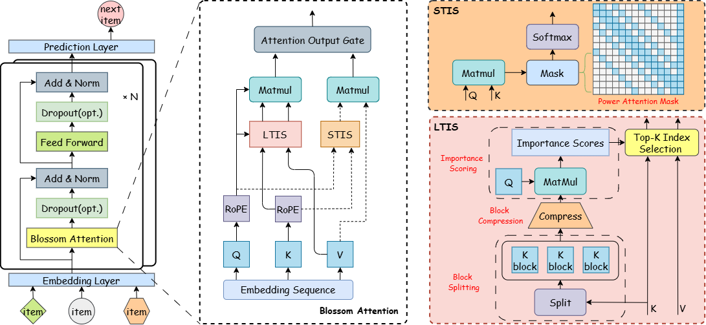

# BlossomRec: Block-level Fused Sparse Attention Mechanism for Sequential Recommendations

### [Paper](https://arxiv.org/abs/2512.13368)

**[2026-01]** We are thrilled to announce that BlossomRec is **accepted by The Web Conference 2026!** 🎉🎉🎉 Please feel free to reach out at Dubai!



BlossomRec is designed for Transformer-based architecture for sequential recommendation. The core innovation lies in the dual-pathway design: firstly, we designed Long-Term Interest Selection (LTIS) to model user long-term interests, which selects some blocks, while to model short-term interests from user interactions, we designed Short-Term Interest Selection (STIS), which used a sparse mask. To achieve optimal and stable performance across various sequence lengths, these two attention pathways are dynamically combined through a learnable gating MLP, enabling the model to adaptively balance long-term and short-term interests. It is an efficient solution for long-sequence sequential recommendations.

## Build

### Prerequisites

* Triton 3.2(Triton-windows is also supported) or higher
* PyTorch 2.6 or higher
* Python 3.12 or higher
* RecBole 1.2.1
* Ampere/Ada Lovelace/Hopper NVDIA GPUs are suggested; if you are using Blackwell GPUs, you may need to update PyTorch to the latest version.

### Install dependencies

```bash
pip install -r requirements.txt
```

### Run BlossomRec

```bash
python run.py
```

### File Places

```text
RecBole/
├── requirements.txt
├── recbole/
│   ├── model/
│   │   ├── sequential_recommender/
│   │   │   ├── blossomrec.py
│   │   │   ├── BlossomAttn.py
│   │   │   ├── tensor_typing.py
│   │   │   ├── tritonAttn.py
│   │   │   └── _init_.py  
│   └── properties/
│       └── model/
│           └── blossomrec.yaml
└── run.py
```

When you meet some bugs from RecBole, you can try replace these files. \
RecBole/recbole/config/configurator.py\
RecBole/recbole/quick_start/quick_start.py

## Acknowledgements

We thank [lucidrains](https://github.com/lucidrains/native-sparse-attention-pytorch).
